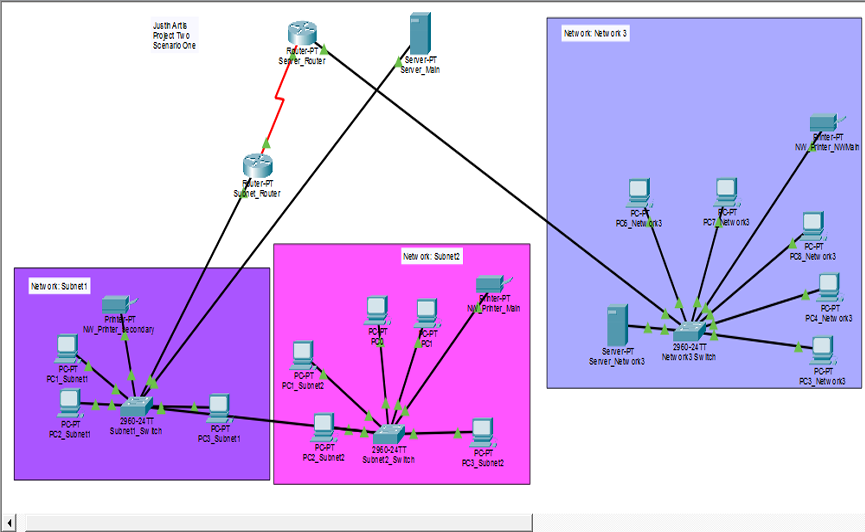

🌐 Network Integration & Segmentation Project

Cisco Packet Tracer Network Design

📌 Project Overview

This project demonstrates the design and configuration of a multi-network environment using Cisco Packet Tracer.

The goal was to combine two existing network areas into one easier-to-manage network while keeping a newly acquired network separated on its own segment.

The project includes IP addressing, DHCP, static IP addresses, routers, switches, static routing, NAT/PAT configuration, and connectivity testing.

🛠️ Technologies & Networking Concepts

- Cisco Packet Tracer
- IPv4 Addressing
- Subnetting
- DHCP
- Static IP Addressing
- Static Routing
- NAT/PAT
- Routers and Switches
- Network Segmentation
- Default Gateways
- Connectivity Testing
- Basic Network Troubleshooting

🗺️ Network Topology

The network contains two main environments:

- **NetworkA** – combines the original Subnet 1 and Subnet 2
- **Network 3** – remains on its own separate network

The two environments communicate through routers connected by a dedicated transit network.

# Design Rationale

## 1. Combining Subnet 1 and Subnet 2

Subnet 1 and Subnet 2 were originally separate network areas.

To simplify the network design and make it easier to manage, I combined them into one network called **NetworkA**.

NetworkA uses:

**Network Address:** `192.168.1.0/24`  
**Subnet Mask:** `255.255.255.0`

### Switch Connection

`Subnet1_Switch` and `Subnet2_Switch` are connected directly.

This allows the devices connected to both switches to operate on the same local network.

### Default Gateway

`Subnet_Router` provides the default gateway for NetworkA.

**Gateway:** `192.168.1.1`

Devices use this gateway when they need to communicate outside their local network.

### DHCP Server

`Server_Main` is configured with the static IP address:

`192.168.1.2`

The server provides DHCP services to client computers on NetworkA.

The DHCP address range is:

`192.168.1.100 - 192.168.1.200`

This allows client computers to automatically receive their IP address, gateway, and other network settings instead of configuring each computer manually.

---

## 2. Keeping Network 3 Separate

Network 3 represents a newly acquired environment containing existing devices.

Instead of immediately combining those devices with NetworkA, I kept Network 3 on its own network.

Network 3 uses:

**Network Address:** `192.168.10.0/24`  
**Subnet Mask:** `255.255.255.0`

Keeping the environment separate provides better control over the devices while still allowing communication between the two networks when needed.

### Network 3 Gateway

`Server_Router` acts as the gateway for Network 3.

**Gateway:** `192.168.10.1`

### Static IP Addresses

Devices in Network 3 use static IP addresses instead of receiving addresses from the DHCP server on NetworkA.

Example addresses include:

**Workstations:**  
`192.168.10.101 - 192.168.10.105`

**Server_Network3:**  
`192.168.10.2`

**Network Printer:**  
`192.168.10.150`

All Network 3 devices use:

**Default Gateway:** `192.168.10.1`

Using static addresses makes important devices easier to identify and manage.

---

## 3. Connecting the Two Networks

`Subnet_Router` and `Server_Router` are connected using a dedicated point-to-point transit network.

The transit network uses:

`10.0.0.0/30`

Router addresses:

**Subnet_Router:** `10.0.0.1`  
**Server_Router:** `10.0.0.2`

A `/30` network works well for this connection because only two usable IP addresses are needed.

---

## 4. Static Routing

Static routes were configured so each router knows how to reach the network on the other side.

`Subnet_Router` sends traffic for:

`192.168.10.0/24`

toward:

`10.0.0.2`

`Server_Router` sends traffic for:

`192.168.1.0/24`

toward:

`10.0.0.1`

This allows devices on NetworkA and Network 3 to communicate even though they are on different networks.

---

## 5. NAT/PAT Configuration

NAT/PAT was also configured on the routers as part of the network configuration.

This gave me hands-on practice working with address translation and understanding how routers can translate addresses as traffic moves between network interfaces.

Static routing is responsible for telling the routers how to reach the different internal networks.

---

## 🧪 Testing and Verification

After configuring the network, I tested the environment inside Cisco Packet Tracer.

### DHCP Testing

Client computers on NetworkA successfully received:

- Dynamic `192.168.1.x` IP addresses
- Default gateway `192.168.1.1`
- DNS information from `192.168.1.2`

This confirmed that the DHCP configuration was working.

### Local Connectivity Testing

NetworkA computers were able to successfully ping:

**Default Gateway:**  
`192.168.1.1`

**Server_Main:**  
`192.168.1.2`

This confirmed basic communication inside NetworkA.

### Cross-Network Testing

I also tested communication between the two separate networks.

A computer in NetworkA successfully communicated with:

`Server_Network3 - 192.168.10.2`

This confirmed that the router connections and static routes were working correctly.

---

## 🧠 Skills Demonstrated

This project gave me hands-on practice with:

- Building a network topology in Cisco Packet Tracer
- Connecting routers, switches, servers, printers, and workstations
- Planning IPv4 address ranges
- Working with `/24` and `/30` networks
- Configuring default gateways
- Configuring DHCP
- Assigning static IP addresses
- Connecting separate networks
- Configuring static routes
- Working with NAT/PAT
- Segmenting network environments
- Testing connectivity using ping
- Troubleshooting addressing and routing problems
- Documenting network design decisions

---

## 💡 What I Learned

This project helped me better understand how different networking concepts work together.

Instead of looking at DHCP, IP addressing, routing, and subnetting as separate topics, I was able to see how each one plays a role in building a working network.

I also gained a better understanding of why network segmentation can be useful when integrating an existing or newly acquired environment.

The project reinforced the importance of testing each part of a network individually before testing communication across the entire environment.

---

## 📁 Project Files

This repository includes:

- Cisco Packet Tracer network topology
- Network topology diagram
- Network design documentation
- Testing and verification results

---

## 🎓 Project Background

This project was originally completed as part of my cybersecurity and networking coursework.

I included it in my technical portfolio to demonstrate hands-on experience with network design, IP addressing, DHCP, routing, segmentation, and troubleshooting using Cisco Packet Tracer.
